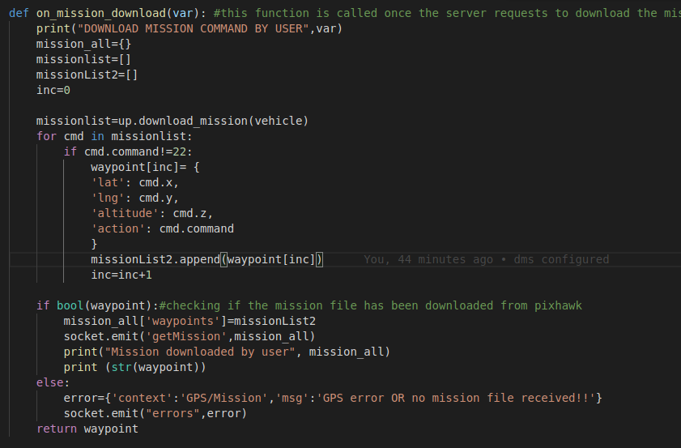

# dronekit_delivery
## About
This repo contains python code to establish a socket connection with server by which an android app can retrieve drone data as well as send commands like RTL, takeoff, land, upload missions to drone via dronekit simulation or a real pixhawk flight controller.

* The main code is sendData.py which establishes socket communication with the server to enable communication with client via android app.
* server_test.py is a test code to test successful socket connection to the server.
* drone.service is a systemd service program to start sendData.py on bootup of companion computer, ie. raspberry pi. It needs to be copied to /etc/system/systemd folder and the service needs to be  enabled and started.


## Method of Operation
* The dronekit delivery software requires a node server to be setup to establish a successful socket connection and communicate. Follow the instructions as suggested from <a> https://github.com/prokuranepal/Drone-Monitoring-server/tree/development </a> and setup the server first. 

* After successful server setup then you can proceed on working of dronekit delivery. Install all python dependency packages
```
    pip install -r requirements.txt

```
* Make a few edits to the code <b>sendData.py</b>. Specifically change the ip/domain of the server, ie    
```
    socket1 = SocketIO('https://nicwebpage.herokuapp.com', verify =True)

    REPLACE IT WITH THE IP/DOMAIN OF YOUR SERVER

    socket1 = SocketIO('http://10.42.0.200', 3000, verify=True) #here 3000 is port number 
```

* Make sure you are connected to the internet. Now you are good to go. Run:
```
python sendData.py #sends data to server using dronekit simulation
```
* You can also connect a real pixhawk flightcontroller to the pc/onboad computer using a <b>usb cable</b> and run the code as:
```
    python sendData.py --connect /dev/ttyACM0
```

* If you want to just test the socket connection with server without the need to run simulation run:
``` 
    python server_test.py
```
* You can also view the drone status and give commands to drone using android app. Refer 
<a> https://github.com/Swainstha/DroneFly.git </a> to build an android app to receive data or send commands to the drone.

---

### Auto start at bootup(Only for Linux distro)
* To start the code at boot we will create a systemd service. Create a new <b>drone.service</b> file in <b>/etc/systemd/system</b>
```
    cd /etc/systemd/system 
    nano drone.service
```
* Copy and paste the following contents in drone.service file
```
[Unit]
Description = dronekit delivery
After=network-online.target
Wants= network-online.target

[Service]
ExecStart= python -u /home/dronekit_delivery/sendData.py --connect #changethe path of sendData as appropriate
Restart=always

[Install]
WantedBy=multi-user.target
```
* Run the following commands on terminal
```    
    sudo systemctl enable drone
    sudo systemctl start drone
    sudo systemctl daemon-reload
```
* That's it restart the system and it will execute automatically. You can also check the status of the service using:
```
    sudo systemctl status drone
```


#### socket listening endpoints (socket.on)
* "homePosition" //to listen for home position request and emit home position on request
* "getMission" //to read mission from pixhawk and emit to server, here calls <b> on_mission_download</b> 
* "initiateFlight" //to initiate take off and fly in auto
* "mission" // update or upload mission from server to pixhawk, here calls update_mission, which in turn calls <b>add_mission</b>



#### Socket emitting endpoints (socket.emit)
* "getMission" //emit mission downloaded from pixhawk to server(same endpoint as socket.on)
* "homePosition" // emit home position to server once on initialization and afterwards on request

#### Mission Format for both send and receive
```
	{
  name: 'asasas',
  radius: '20',
  speed: '20',
  home: 'Biratanagr',
  destination: '5f2bb9d7e0d78272f38eb279',
  waypoints: [
    {
      altitude: 0,
      radius: 0,
      action: 'takeoff',
      lat: 26.818175084140602,
      lng: 87.28325418453437
    },
    {
      altitude: '20',
      radius: '20',
      action: 'waypoint',
      lat: 26.817065334581564,
      lng: 87.28149404510873
    },
    {
      altitude: 0,
      radius: 0,
      action: 'land',
      lat: 26.817773279520665,
      lng: 87.27882163829784
    }
  ]
}
```

* Not: For emitting mission to server, for now just waypoints will suffice


